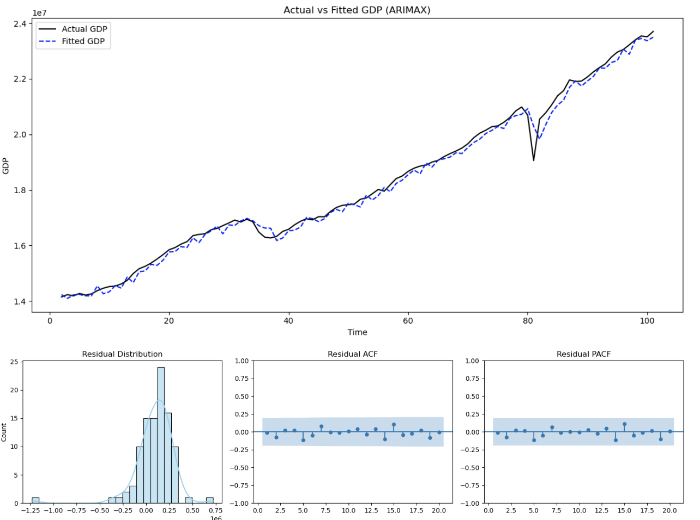

# Data Portfolio
## Education 
- B.S. Economics | Davidson College (August 2021 - May 2025)

## Technical Skills 
- SQLite, Power BI, MS Excel, Python, R Studio, Stata

## Work Experience
***Economics Research Assistant @ Davidson College***  
- Web-scrapped, cleaned, and normalized 180,000+ sermon transcripts from a public archive 
- Applied NLP libraries for tokenization, lemmatization, and keyword extraction 
- Developed data-driven visualizations in R and Python to communicate key findings effectively 
- Summarized and synthesized key research papers and policy reports to map prior literature 

***Data Analyst Intern @ DEI Directive***  
- Entered, validated, and analyzed EEO-1, ESG, and CR data to support DEI-driven business decisions 
- Applied reshaping, merging, and normalization techniques to create benchmarking datasets 

***Stats & Basic Econometrics Embedded Tutor @ Davidson College*** 
- Guided students in statistical modeling, data software, and complex statistical concepts 
- Adapted teaching strategies to diverse learning styles, reinforcing both technical skills and confidence in data literacy 
- Covered topics such as: descriptive stats, linear regression, hypothesis testing, probability, and residual analysis 
  

## Projects 
***Idenitfying Rheotrical Obscuration in U.S. Presidential Speeches*** 
- Developed NLP pipelines incorporating LDA topic modeling, GloVe word embeddings, and K-means clustering to reveal thematic and semantic trends 
🔗 [View the full repository](https://github.com/doughertylia-beep/thesis.git) 

***Sermon Webscraping and Data Visualizations***
- Web-scraped, cleaned, and normalized 180,000+ sermon transcripts from a public archive using Python 
- Conducted graphical analyses of sermon keywords pertaining to civic participation, examined in relation to the timing of midterm and presidential elections 
🔗 [View the full repository](https://github.com/doughertylia-beep/sermon_project.git) 

***Time-series ARIMAX Modeling for GDP***
- Conducted comprehensive exploratory data analysis (EDA) on quarterly GDP, Consumer Confidence, and Residential Building Permits using time-series plots, ACF/PACF analyses, and seasonal decomposition
- Applied first-differencing transformations to achieve stationarity and validated results using KPSS tests
- Implemented a stepwise automated search to identify the optimal ARIMAX model for GDP forecasting, incorporating Residential Building Permits and Consumer Confidence Index as exogenous predictors
- Evaluated model performance through residual diagnostics, including ACF/PACF inspections and the Ljung–Box test, to ensure model adequacy and independence of residuals 
🔗 [View the full repository](https://github.com/doughertylia-beep/forecasting.git)  

***Power BI Crime Report Dashboard***
- Designed and developed an interactive crime reporting dashboard in Power BI 
- Incorporated dynamic filters, charts, and ArcGIS map to enable intuitive data exploration 
- Applied Figma-inspired design principles to enhance usability and visual appeal 
🔗 [View the dashboard](https://app.powerbi.com/view?r=eyJrIjoiNjc0NDg2ZmItMzcyNC00NjFiLTlmOTctN2FjMzM3NjRkNTFkIiwidCI6IjM1ZDg3NjNjLWQyYjEtNDIxMy1iNjI5LWY1ZGYwYWY5ZTNjMyIsImMiOjF9) 

